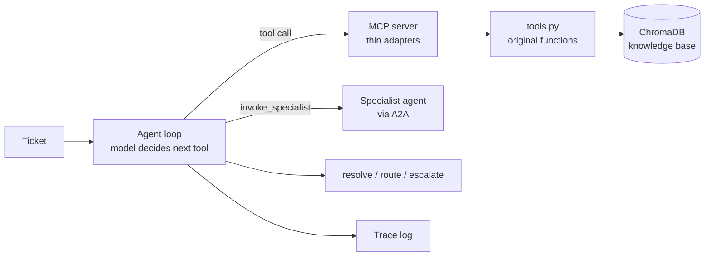

# Support Triage Agent

An LLM agent that reads a customer support ticket, decides which tools to call, and ends in one of three outcomes: resolve it, route it to a queue, or escalate it to a human. A three-layer confidence gate sits between the model and any automatic resolution, so the model cannot talk its way past a hard rule.

The agent loop is written by hand against the raw Anthropic API, with no agent framework. The repo also contains an MCP server that exposes the same tools, a labeled evaluation harness, a structured trace for every run, and a handoff to a separate specialist agent over A2A.

## What it does

For each ticket the model works through a small set of tools:

1. **Classify** the ticket by category and urgency.
2. **Search** a knowledge base for relevant policy text.
3. **Propose** a resolution, which the confidence gate then approves or blocks.
4. **Finish** by resolving the ticket, routing it to a queue, or escalating it.

Billing tickets with an order ID take one extra step. The gate blocks every billing ticket, so before escalating, the model asks a Billing Investigation specialist to look at the case. The specialist can close it automatically or defer, in which case the agent escalates as before. See [Specialist handoff](#specialist-handoff).

## Architecture

The repo has two agent loops that share the same tool functions.



| Loop | File | How it calls tools | Used by |
|---|---|---|---|
| Direct | `src/agent_loop.py` | In-process function calls | The deployed Streamlit app |
| MCP | `src/mcp_agent_loop.py` | `await client.call_tool(...)` against `src/mcp_server.py` over stdio | The MCP eval run and the specialist handoff |

`agent_loop.py` was left untouched when MCP was added, so the direct version stays deployable without spawning a server subprocess. The MCP server wraps the original `tools.py` functions without modifying them. The wrapped tool names match the originals exactly, so the loop's termination logic works on both paths unchanged.

## Tools

| Tool | Input | What it returns |
|---|---|---|
| `classify_case` | The ticket | Category, urgency, and a `case_handle` |
| `search_knowledge_base` | `case_handle`, a search query the model writes | Top similarity score and the retrieved chunks |
| `propose_resolution` | `case_handle`, a proposed answer, a self-reported confidence | Gate result: `passed` or `blocked`, with each layer's verdict |
| `route_to_queue` | Queue, reason | Ends the ticket |
| `escalate` | Reason | Ends the ticket |
| `invoke_specialist` | `order_id` | The specialist's decision and reason |

`case_handle` threads state between calls. The server keeps the case's category, urgency and retrieval score in `case_state`, keyed by the handle. The gate reads those values from server state, not from the model, so the model cannot supply its own inputs to the gate.

Parameters that must be one of a fixed set of values (category, urgency, queue, confidence) use `Literal[...]` type hints. A bare `str` produces no enum in the generated schema, and the model then guessed invalid categories.

## The confidence gate

`propose_resolution` runs three checks in order and stops at the first one that blocks.

| Layer | Checks | Blocks when |
|---|---|---|
| 1. Hard rules | Category and urgency | The ticket hits a hard rule. Billing tickets are always blocked here |
| 2. Retrieval confidence | Top similarity from the knowledge base | The score is below the threshold (0.25) |
| 3. Self-reported confidence | The model's own confidence in its answer | The model reports low confidence |

Because the layers run in order, a Layer 1 block returns before Layers 2 and 3 are evaluated. That is why a billing ticket shows `layer_2: null` in its trace.

A case ends automatically only when the gate returns `passed`. Anything else ends in a route or an escalation.

## Specialist handoff

The specialist lives in its own repository: [billing-investigation-specialist](https://github.com/Sameors/billing-investigation-specialist). It is a LangGraph agent exposed over the A2A protocol. The two repos share no code. The only contract is the specialist's Agent Card and task lifecycle.

`invoke_specialist` is the bridge. The triage agent only speaks MCP, and this tool acts as the A2A client:

1. Fetch the specialist's Agent Card to find its base URL.
2. Submit a task with the ticket's `order_id`.
3. Poll for the result, up to 5 times, 5 seconds apart.
4. Return `{"resolve": ..., "reason": ...}`. If the specialist does not resolve in that window, or is unreachable, the result tells the agent to escalate.

**When it fires.** The trigger is model-driven, written into the system prompt: the gate returned `blocked` at Layer 1, the category is billing, and the ticket carries an `order_id`. The ID reaches the model as a metadata line appended to the ticket text. If there is no order ID, the model skips the specialist and escalates.

**How it ends.** A specialist `resolve` is a final step, so the loop stops there. Any other outcome is not final, and the agent then calls `escalate`. Escalation stays the one path by which a case reaches a human.

**What it needs.** The specialist's two services must be running (ledger mock on port 8000, A2A server on port 8001). If they are down, the tool returns a deferral and the case escalates.

## Traces

Every run produces a structured trace: an ordered list of steps, one per tool call. Each step records:

- `step_number` and `step_type` (`tool_call`, `correction`, `error`, `duplicate_call`, `timeout_escalate`)
- `name`, the tool that was called
- `details`, what the tool returned
- `tool_input`, the arguments the model sent

Recording the model's arguments matters for the handoff, because the model writes the `order_id` itself. Without it, a made-up ID would not show up in any check.

Two guards protect the loop. A repeat-call guard catches the model calling the same tool again without new information. An iteration cap (`MAX_ITERATIONS`) ends a runaway case as `timeout_escalate`. When a guard fires, the expected outcome becomes an escalation.

## Evaluation

The eval harness scores a labeled dataset of 7 tickets in two passes.

**Pass 1: outcome.** Did the final action match what was expected? If a guard fired, the guard-triggered outcome is expected instead. `expected_final_action` can be a list when more than one outcome is legitimate.

**Pass 2: behavior.** Did the trace look right?
- **Tool sequence.** The expected tools must appear in order as a subsequence. Extra calls are tolerated so guard detours do not cause false failures.
- **Forbidden tools.** A case can list tools that must never appear. Subsequence matching cannot catch an unwanted call, so `forbidden_tools` does. Cases with no order ID forbid `invoke_specialist`.
- **Handoff argument.** When a case expects `invoke_specialist`, the `order_id` the model sent must equal the case's `order_id`.
- **Layers.** For the four cases whose gate outcomes are stable, each layer's verdict is checked. Cases whose retrieval score sits near the threshold are excluded from strict layer assertions.

| Case | Covers | Expected |
|---|---|---|
| 01 billing dispute | Duplicate charge, specialist resolves | Resolve |
| 02 account cancellation | Straightforward policy answer | Resolve |
| 03 delayed shipment | Outcome depends on model confidence | Resolve or route |
| 04 account query | Layer 2 retrieval block | Route |
| 05 mixed request | Cancellation plus a billing complaint | Escalate |
| 06 billing issue | Specialist finds a related dispute | Escalate |
| 07 login problem | All three layers pass | Resolve |

Latest run on the handoff branch: 7/7 on outcome, 7/7 on sequence, 4/4 on layer checks (3 not applicable). Cases 01 and 06 need the specialist services running.

The harness is the merge gate. The MCP path was first proven against the same dataset with the same pass rates as the direct loop, before any specialist work began.

## Design decisions

- **No agent framework.** The loop is written by hand so every step between tool calls is visible to the trace and the gate.
- **Hand-rolled MCP over stdio, not the API's MCP connector.** The connector needs a public HTTPS server and resolves tool calls server-side in one round trip. That would remove the visibility the trace and the gate depend on.
- **Adapters, not rewrites.** The MCP server registers the original functions unmodified.
- **One long-lived client session per eval run.** Reloading the embedding model for each ticket cost about 28 seconds.
- **Evals decide merges.** New behavior goes on a branch, and the harness has to hold its baseline before it merges.
- **Model-driven handoff.** The trigger is a prompt instruction, not code in the loop, so the loop's control flow stayed unchanged. The cost is that the trigger is only as reliable as the model, which is why the argument and forbidden-tool checks exist.

## Run it

Requirements: Python 3.10 or newer (developed on 3.14).

```powershell
python -m venv venv
venv\Scripts\Activate.ps1
pip install -r requirements.txt
```

Put your Anthropic API key in a `.env` file at the repo root:

```
ANTHROPIC_API_KEY=your-key-here
```

Run the eval on the MCP path, from the repo root:

```powershell
python data\evals\run_eval_mcp.py
```

Run the tests:

```powershell
pytest
```

Run the Streamlit UI: `streamlit run app\<entry file>.py` (TODO: add the real file name).

For cases 01 and 06, start the specialist first. See the [specialist repo](https://github.com/Sameors/billing-investigation-specialist) for its two commands.

## Repository layout

```
src/
  tools.py             Original tool functions and the confidence gate
  retrieval.py         Knowledge base retrieval
  agent_loop.py        Direct agent loop (deployed)
  mcp_server.py        MCP adapters around tools.py
  mcp_agent_loop.py    MCP agent loop
data/evals/
  checks.py            check_pass_1 and check_pass_2
  run_eval_mcp.py      Runs the dataset through the MCP loop
app/                   Streamlit UI (eval runner, trace viewer)
tests/                 Unit tests
docs/                  Diagrams and write-ups
```

## Deployment

The direct loop and the Streamlit UI are deployed on Streamlit Community Cloud. The deployed app does not use MCP and cannot reach the specialist, which runs locally.

## Known limitations

These are deliberate scope decisions.

- **Non-determinism.** Some cases flip between outcomes across runs, because the model writes the search query and its own confidence. Case 03 accepts two outcomes for this reason.
- **Prompt injection.** The model sometimes refuses to call tools on sparse or adversarial input. The identified remedy is the `tool_choice` API parameter.
- **Duplicate step numbers.** Two tool calls in one model turn get the same `step_number`.
- **Order ID is structured input.** The order ID is a separate field. Extracting it from free-text tickets is not built.
- **Handoff reliability is unmeasured at scale.** Cases 01 and 06 pass in repeated runs, but there is no large-sample measure of how often the model triggers the specialist correctly.
- **The specialist runs locally.** The deployed app cannot invoke it.

## Screenshots

- [ ] A resolved ticket with its trace
- [ ] The eval table
- [ ] The trace of a specialist handoff (case 01)
- [ ] The Streamlit UI

## Related

- [Billing Investigation Specialist](https://github.com/Sameors/billing-investigation-specialist): the LangGraph and A2A agent this one hands off to.
